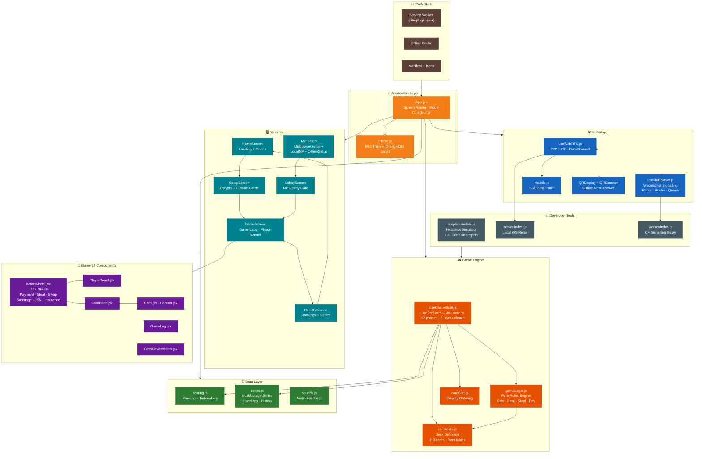

# Architecture

## Overview

Dhandha is a **fully client-side card game PWA** — a digital adaptation of Monopoly Deal with Indian-city theming. The entire game engine runs in a single `useReducer` on the browser; there is no backend for gameplay. Multiplayer is handled peer-to-peer via WebRTC with optional WebSocket signalling.

```
┌─────────────────────────────────────────────────────────────┐
│                      PWA Shell (index.html)                  │
│  Service Worker · Manifest · Offline Cache (vite-plugin-pwa) │
└──────────────────────┬──────────────────────────────────────┘
                       │
┌──────────────────────▼──────────────────────────────────────┐
│                    App (src/App.jsx)                         │
│  Screen Router · Series Recording · Multiplayer Coordinator  │
└──┬─────────┬──────────┬──────────┬─────────────────┬────────┘
   │         │          │          │                 │
   ▼         ▼          ▼          ▼                 ▼
┌──────┐ ┌──────┐ ┌────────┐ ┌──────────┐ ┌────────────────┐
│Screens│ │ Game │ │Multipl.│ │Scoring   │ │ Headless       │
│      │ │Engine│ │ (WAN)  │ │& Series  │ │ Simulator      │
└──────┘ └──────┘ └────────┘ └──────────┘ └────────────────┘
```

---

## Directory Structure

```
src/
├── main.jsx                    # Entry point
├── App.jsx                     # Root component — screen router + state coordinator
├── theme.js                    # MUI theme (brand: orange, DM Sans, Material Design 3)
│
├── game/                       # ★ Core game engine (non-UI, pure logic)
│   ├── constants.js            # Deck definition: 110 cards, rent tables, colour palette
│   ├── gameLogic.js            # Rules engine: deal, draw, rent, steal, pay, win check
│   ├── useGameState.js         # useReducer state machine — 40+ action types, 12 phases
│   ├── cardSort.js             # Display ordering helpers (never mutates game state)
│   ├── scoring.js              # End-game ranking with 4-tier tiebreakers
│   ├── series.js               # localStorage-backed multi-game series tracking
│   └── sounds.js               # Audio feedback for card actions
│
├── components/
│   ├── screens/                # App-level screens (routed by App.jsx)
│   │   ├── HomeScreen.jsx      # Landing page — hero, modes, rules, strategy
│   │   ├── SetupScreen.jsx     # Player count, names, custom cards toggle
│   │   ├── GameScreen.jsx      # Main game loop — renders board, handles phases
│   │   ├── ResultsScreen.jsx   # Rankings, series standings, next-game actions
│   │   ├── LobbyScreen.jsx     # Multiplayer lobby — player list, ready gate
│   │   ├── MultiplayerSetupScreen.jsx   # Cloud multiplayer room/create
│   │   ├── LocalMultiplayerSetupScreen.jsx  # LAN hotspot room setup
│   │   └── OfflineSetupScreen.jsx  # WebRTC direct (QR + ICE exchange)
│   │
│   └── game/                   # Game UI components
│       ├── Card.jsx            # Card renderer (all types, gradient backgrounds)
│       ├── CardArt.jsx         # Inline SVG city landmark icons
│       ├── CardHand.jsx        # Ordered hand display with selection
│       ├── PlayerBoard.jsx     # Bank + property sets + buildings
│       ├── ActionModal.jsx     # Bottom-sheet action flows (10+ sub-components)
│       ├── GameLog.jsx         # Event log
│       └── PassDeviceModal.jsx # Turn handoff screen (pass-and-play)
│
├── multiplayer/               # ★ Network layer
│   ├── useWebRTC.js            # WebRTC peer connection management
│   ├── useMultiplayer.js       # WebSocket signalling + state management
│   └── rtcUtils.js             # SDP strip/patch utilities
│
├── components/multiplayer/     # QR exchange UI
│   ├── QRDisplay.jsx
│   └── QRScanner.jsx
│
└── assets/                     # Static assets (icons, images)
```

Supporting files:

```
worker/
└── index.js              # Cloudflare Workers — WebSocket signalling relay (optional)

scripts/
└── simulate.js           # Headless simulation runner (deterministic game replay)

server/
└── index.js              # Local WebSocket relay for LAN hotspot mode
```

---

## Functional Areas

The codebase decomposes into 7 major functional areas (identified by community detection on the call graph):

### 1. Game State Machine (comm_10 · 17 symbols)
**Core:** `gameReducer` in `useGameState.js`

The heart of the app. A `useReducer` handling 40+ action types across 12 phases:
`DRAW → PLAY → ACTION_RESPONSE / RENT_COLLECT / *_SELECT → INSURANCE_RESPONSE / JSN_RESPONSE → DISCARD → GAME_OVER`

Every action `deepClone`s state, applies pure logic, and returns the next state. Three-layer defence-in-depth: UI disables illegal buttons → action creator validates → reducer guards post-dispatch.

**Key functions:** `gameReducer`, `deepClone`, `startTurn`, `endTurn`, `playPropertyCard`, `playCardToBank`, `drawCards`, `applyPayment`, `executeDealBreakerSteal`, `executeSlyDeal`, `executeForcedDealSwap`, `checkWinner`, `reactivateBuildings`, `deactivateBuildings`

### 2. Rules Engine (comm_8 · 10 symbols)
**Core:** `gameLogic.js`

Pure functions for game rules. No React, no side effects.

**Key functions:** `isSetComplete`, `countCompleteSets`, `checkWinner`, `getRentForColor`, `eligibleColors`, `applyPayment`, `playCardToBank`, `playPropertyCard`, `startTurn`, `endTurn`, `deactivateBuildings`, `reactivateBuildings`

### 3. Deck Definition (comm_16 · 8 symbols)
**Core:** `constants.js`

Source of truth for the 110-card deck: 28 properties (Indian cities), 20 money, 34 actions, 13 rent, 11 wild properties, 4 optional custom cards. Also houses the rent tables, colour palette, and property-set definitions.

**Key functions:** `createDeck`, `makeProp`, `makeWild`, `makeMoney`, `makeAction`, `makeRent`, `shuffle`

### 4. App & Series (comm_0 · 11 symbols)
**Core:** `App.jsx` + `series.js`

Root coordinator: screen routing, multiplayer mode management, series recording to localStorage. Calls `initGame` to bootstrap the reducer.

**Key functions:** `App`, `handleStartGame`, `handleNextGame`, `handleStartMultiplayerGame`, `handleRoomReady`, `handleGoHome`

**Series:** `loadSeries`, `saveSeries`, `recordGame`, `getStandings`, `resetSeries`

### 5. WebRTC Multiplayer (comm_9 · 14 symbols)
**Core:** `useWebRTC.js` + `OfflineSetupScreen.jsx`

Peer-to-peer connection via WebRTC. QR-code-based offer/answer exchange. Handles ICE candidate gathering, DataChannel wiring, connection state management.

**Key functions:** `createOffer`, `createAnswer`, `acceptAnswer`, `wireDataChannel`, `waitForICE`, `encodeForQR`, `decodeFromQR`, `stripSDP`, `refreshState`

### 6. WebSocket Signalling (comm_1 · 10 symbols)
**Core:** `useMultiplayer.js` + `LobbyScreen.jsx`

WebSocket connection to Cloudflare Worker signalling relay. Room management, client roster, ready-state gate, message queuing for race-free handshake.

**Key functions:** `connect`, `send`, `start`, `sweep`, `tone`, `handleRoomReady`, `handleToggleReady`, `QRScanner`

### 7. Action Modal Sheets (comm_17 · 12 symbols)
**Core:** Sub-components of `ActionModal.jsx`

Bottom-sheet UIs for each action type: payment, stolen property selection, forced deal swap, sabotage wizard, Just Say No response, and insurance popup.

**Key components:** `PaymentSheet`, `StolenPropertySheet`, `ForcedDealSheet`, `SabotageSheet`, `JsnResponseSheet`, `InsuranceSheet`, `CounterpartyStrip`

---

## Key Execution Flows

### Flow A: Start a New Game (6 steps)
```
App.handleNextGame()
  └─ App.handleStartGame(playerNames, customCards)
       └─ gameLogic.initGame(playerNames, {customCards})
            └─ constants.createDeck(customCards, playerCount)
                 ├─ makeProp(...)  × 28
                 ├─ makeWild(...)  × 11
                 ├─ makeMoney(...) × 20
                 └─ shuffle(cards)
```

**Crosses communities:** comm_4 (init/start) → comm_16 (deck creation)

### Flow B: Game Reducer — Core Loop (4 steps per action)
```
gameReducer(state, action)
  └─ deepClone(state)
  └─ pure rule logic for each action type (40+ case handlers)
  └─ checkWinner(state)
       └─ countCompleteSets(player)
            └─ isSetComplete(player.propertySets[color])
  └─ returns next state (or GAME_OVER)
```

**Crosses communities:** comm_10 (reducer) → comm_8 (rules engine)

### Flow C: Deal Breaker Action (4 steps)
```
executeDealBreakerSteal(state, action)
  └─ Identify target completed set
  └─ Transfer all properties + buildings to attacker
  └─ checkWinner(state)
       └─ countCompleteSets(attacker)
            └─ isSetComplete(...)
```

**Crosses communities:** comm_10 (reducer) → comm_8 (rules engine)

### Flow D: Offline Multiplayer Setup (5 steps)
```
OfflineSetupScreen
  └─ handleNameSubmit(name, role)
       └─ useWebRTC.createOffer() / createAnswer()
            └─ wireDataChannel()
                 └─ refreshState() — begins periodic state broadcast
```

**Intra-community:** comm_9 (all WebRTC setup logic)

### Flow E: Headless Simulation (5 steps)
```
scripts/simulate.js — runGame()
  └─ initGame(playerNames)
       └─ createDeck()
  └─ Game loop (deterministic RNG):
       └─ nextAction() — picks next legal move
       └─ eligibleRentColors() / chooseAssetsToPay() — AI decision helpers
       └─ checkInvariants() — validates state after every action
  └─ All cards accounted for at end
```

**Crosses communities:** comm_6 (simulator) → comm_4 (init) → comm_16 (deck) → comm_7 (AI decisions) → comm_8 (rules validation)

---

## Architecture Diagram



---

## Key Architectural Decisions

| Decision | Rationale |
|----------|-----------|
| **Pure reducer for all game state** | Deterministic, testable, debuggable. Every action deep-clones state → impossible to mutate history |
| **3-layer defence for illegal moves** | UI (disabled buttons) → action creator (pre-dispatch check) → reducer (post-dispatch guard). No unreachable states |
| **WebRTC + WebSocket signalling** | P2P for low-latency gameplay; WebSocket only for room coordination. LAN mode has zero cloud dependency |
| **Zero backend for gameplay** | Entire game engine runs on the client. The only server is an optional WebSocket relay for multiplayer discovery |
| **Headless simulator** | Deterministic RNG + AI move selection + invariant checking. Reproduces bugs from log alone |
| **PWA-first** | Offline-capable, installable, service-worker-cached. No app store required |
